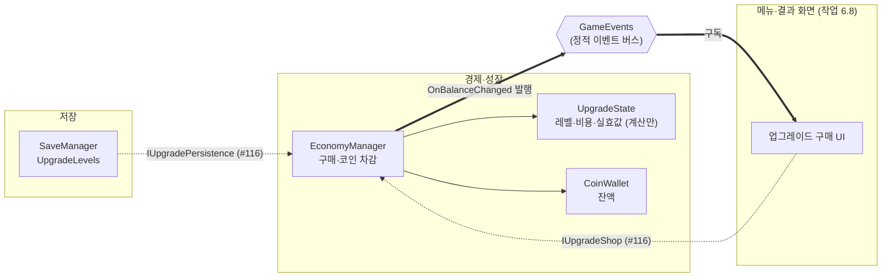

# 업그레이드

> 관련 이슈: #24, #32, #131, #140 · 최종 수정: 2026-09-17

**이 문서는 로그다.** 이 기능을 고칠 때마다 갱신한다. 새 문서를 만들지 않는다.

## 무엇을 하는가

업그레이드 4종의 레벨과 다음 레벨 비용을 계산하고, 코인을 받아 구매를 처리하며,
`upgrade_effects.csv` 의 효과를 얹은 **실효값**을 돌려준다.

계산 규칙 자체는 [BALANCE.md 6절](../BALANCE.md)이 정본이다. 여기서는 그것을 어떻게 구현했는지를 적는다.

**소비처는 #131 에서 연결됐다.** 스태미나·피버·망치·타격 대상·스폰이 `BalanceData` 기준값 대신
`IUpgradeStats.GetStat(stat, 기준값)` 을 읽는다. 배선 방식과 "다음 런부터" 규칙을 어떻게
보장하는지는 아래 "소비처에 닿는 길"에 있다.

## 왜 이 방법인가

| 검토한 방법 | 채택 | 이유 |
|---|---|---|
| 계산부(`UpgradeState`)를 `EconomyManager` 에서 분리 | ✅ | Edit Mode 가 생명주기를 부르지 않아 계산을 MonoBehaviour 안에 두면 검증할 수 없다. `CoinWallet`·`StaminaPool`·`FeverGauge` 와 같은 이유 |
| 업그레이드 전용 매니저를 새로 만든다 | ❌ | 구매는 코인 차감과 한 덩어리다. 매니저를 나누면 "코인만 빠지고 레벨이 안 오르는" 창이 매니저 경계에 생긴다. ARCHITECTURE 1절도 "EconomyManager: 코인, 업그레이드 비용/레벨 계산"으로 묶어 두었다 |
| 런타임에 `BalanceData` 값을 직접 고쳐 효과 반영 | ❌ | CSV 산출물이라 손대지 않는다 (AGENTS.md). 한 번 고치면 다음 임포트까지 값이 어긋나고, 에디터에서 에셋이 dirty 로 남는다. **검증에 "dirty 가 아니다" 항목을 넣어 막아 두었다** |
| `GetStat(StatId)` — 기준값도 내부에서 조회 | ❌ | `spawn_count` 의 기준값은 `stages.csv` 의 **단계별** 값이라 `BalanceData` 한 곳에서 꺼낼 수 없다. 이 stat 하나 때문에 조회 경로가 두 갈래가 된다 |
| `GetStat(StatId, float baseValue)` — 기준값을 받는다 | ✅ | 호출측이 어차피 기준값을 들고 있다. BALANCE 6절 표를 코드에 복제하지 않아도 되고 단계별 값도 자연히 처리된다 |

### 비용 공식에서 `cost_growth` 0 의 뜻

`upgrades.csv` 의 네 종류가 전부 `cost_growth` 를 0 으로 두고 있다. 이건 "성장하지 않는다"가
아니라 **"공통값을 쓴다"** 는 뜻이며, 그때 `economy.csv` 의 `upgrade_cost_growth` 를 쓴다
(BALANCE 3절 "비용 성장률은 4종 공통이며 한 곳에서만 조정한다"). 종류별로 다르게 할 이유가
생기면 그 행에만 0 이 아닌 값을 넣으면 된다.

### percent 를 먼저, add 를 나중에

```
실효값 = 기준값 × (1 + percent 합 / 100) + add 합
```

순서를 바꾸면 더한 값에도 비율이 걸려 같은 레벨에서 다른 수가 나온다. `strong_hammer` 처럼
한 업그레이드가 `add`(타격 파워)와 `percent`(판정 반경)를 **서로 다른 stat 에** 갖는 경우가
있어 헷갈리기 쉽다 — 합산은 stat 별로 따로 한다.

## 구조



점선은 **계약은 있으나 아직 배선되지 않은 경로**다. 계약은 #116 에서 생겼고, 그 계약을
부르는 소비처는 아직 저장소에 하나도 없다.

| 클래스 | 경로 | 하는 일 |
|---|---|---|
| `UpgradeState` | `Assets/Scripts/Runtime/Economy/UpgradeState.cs` | 레벨 보유, 다음 비용, 실효값 계산. Unity 의존 없음 |
| `EconomyManager` | `Assets/Scripts/Runtime/Economy/EconomyManager.cs` | 구매(차감 + 레벨업), 조회 창구 |
| `UpgradeChecks` | `Assets/Scripts/Editor/UpgradeChecks.cs` | 계산부의 Edit Mode 검증 22건 |
| `UpgradeConsumerChecks` | `Assets/Scripts/Editor/UpgradeConsumerChecks.cs` | 실효값이 **소비처에 닿는지** 검증 13건 (#131) |

### 이벤트

| 이벤트 | 발행/구독 | 언제 |
|---|---|---|
| `GameEvents.OnBalanceChanged` | 발행 | 구매가 **성공했을 때만**. 실패하면 발행하지 않는다 |

업그레이드 전용 이벤트는 만들지 않았다. UI 가 구매 즉시 반응해야 하면
`OnUpgradePurchased` 가 필요한데, 필요 여부는 작업 6.8 담당자가 판단할 일이라 #116 에 질문으로 남겼다.

### 구매가 반쪽 나지 않게 하는 법

```
비용 조회 → 실패면 여기서 끝 (코인 손대지 않음)
지갑 차감 → 실패면 여기서 끝 (레벨 그대로)
레벨 +1  → 여기까지 왔으면 둘 다 성공
```

잔액 비교를 `EconomyManager` 에서 따로 하지 않고 `CoinWallet.TrySpendCoin` 하나에 맡긴다.
양쪽에서 비교하면 두 판단이 어긋날 수 있다.

### 소비처에 닿는 길 (#131)

계약(`IUpgradeStats`)은 #116 이 만들었지만 **부르는 곳이 한 곳도 없었다.** 계산이 맞아도
읽는 쪽이 없으면 게임은 그대로다 — 업그레이드를 사도 코인과 레벨만 움직였다.

| 소비처 | 사는 곳 | 누가 넣어 주나 |
|---|---|---|
| `EconomyManager` (`coin_bonus_multiplier`, `fever_multiplier`) | Managers 프리팹 | 자기 자신이 공급자라 주입이 없다 |
| `StaminaManager`, `FeverManager` | Managers 프리팹 | `ManagerBootstrap` |
| `CreatureManager` | Managers 프리팹 | `ManagerBootstrap` (#140 에서 씬 → 프리팹으로 옮겼다) |
| `HammerSwingController` | **씬** | `GameManager` (런 시작) |
| `Target` | 스폰된 인스턴스 | `CreatureManager` 가 `Initialize()` 전에 |

씬 소비처를 `ManagerBootstrap` 이 맡지 못하는 이유는 그것이 **씬 로드 전에** 돌기 때문이다.
`CreatureManager` 는 #140 에서 `Managers` 프리팹으로 옮겨 가 이 제약에서 벗어났고, 주입도
`ManagerBootstrap` 으로 넘어갔다. **`GameManager` 쪽에 남겨 두면 안 된다** — 프리팹에 있는 것을
씬 목록에도 넣으면 `BeginRun()` 이 두 경로로 불려 두 번째 호출이 퍼크 반경을 지운다.
`GameManager` 가 맡는 것은 ARCHITECTURE 가 "조립하는 지점(ManagerBootstrap 또는 GameManager
초기화) 한 곳만 구현 클래스를 알고, 그 뒤의 상호작용은 인터페이스로만 한다"고 정해 두었기 때문이다.

**주입이 없어도 죽지 않는다.** 모든 소비처가 `_upgradeStats == null` 이면 기준값을 그대로 쓴다 —
배선이 빠진 화면에서 게임이 멈추는 것보다 업그레이드만 안 먹는 편이 낫다.

### "다음 런부터"를 어떻게 지키나

BALANCE 6절이 "구매는 메뉴·결과 화면에서, 효과는 다음 런부터"라고 정했다. 호출 시점을 지키라고
당부하는 대신 **런 시작에 실효값을 굳혀** 구조로 만들었다 — `BeginRun()` 이 `GetStat` 을 부르고,
이후에는 굳힌 값만 쓴다. 런 도중에 레벨이 올라도 이번 런은 변하지 않는다.

예외가 하나 있다. `spawn_count` 는 **기준값이 단계마다 다르다**(`stages.csv`). 굳혀 두면 단계가
오를 때 옛 값이 남으므로 조회 시점에 계산한다. 여기서는 "레벨은 런 도중 바뀌지 않는다"는
규칙에 기댄다 — #116 이 기준값을 호출측이 넘기도록 계약을 정한 이유가 이 stat 이다.

배율 캐시에는 `_hasCachedMultipliers` 플래그를 따로 둔다. **0 을 "아직 안 채움"으로 쓸 수 없다** —
배율 0 은 코인을 통째로 없애는 값이라, 초기화 누락과 구별되지 않으면 수입이 조용히 사라진다.
실제로 이 플래그가 없을 때 `Awake` 가 돌지 않은 경로에서 지급액이 0 이 되는 것을 검증이 잡았다.

### 걷어낸 방식 — 조립 지점이 증분을 계산해 밀어 넣기

`CreatureManager.SetUpgradeOverrides(int bonusSpawnCount, float intervalMultiplier)` 가 있었다.
stat 마다 인자를 늘려야 하고(`+N` 이냐 `×배` 냐도 제각각), 무엇보다 업그레이드 반영 경로가
`IUpgradeStats` 와 **두 갈래**가 된다. #131 에서 걷어냈다.
`AutoHammerController.SetBonusCount(int)` 는 같은 방식이지만 자동 망치(작업 3.2)의 몫이라 남겼다.

### 저장 배열의 자리

`SaveData.UpgradeLevels` 는 `int[]` 이고 **`upgrades.csv` 의 `sort_order` 순**이다
(ARCHITECTURE "SaveData" 주석). 임포터가 `BalanceData.Upgrades` 를 `SortOrder` 로 정렬해 두므로
그 목록의 인덱스와 저장 배열의 인덱스가 같다. **`sort_order` 를 바꾸면 기존 저장 파일의
레벨이 다른 업그레이드에 붙는다** — 바꿀 때는 저장 버전도 함께 올려야 한다.

길이가 맞지 않으면 겹치는 만큼만 복원하고 경고를 남긴다. 최대 레벨을 넘거나 음수인 값은
잘라낸다 — 저장 파일은 손으로 고칠 수 있고 `max_level` 이 나중에 낮아질 수도 있다.

### 읽는 밸런스 값

| CSV | 열 | 쓰는 곳 |
|---|---|---|
| `upgrades.csv` | `id`, `init_cost`, `cost_growth`, `max_level`, `sort_order` | 비용·상한·저장 자리 |
| `upgrades.csv` | `display_name`, `description` | 읽지 않는다 — UI(작업 6.8)의 몫 |
| `upgrade_effects.csv` | `upgrade_id`, `stat`, `effect_type`, `value_per_level` | 실효값 계산 |
| `economy.csv` | `upgrade_cost_growth` | `cost_growth` 가 0 일 때의 공통 성장률 |

## 검증

Edit Mode 에서 `UpgradeChecks.RunBatch()` 로 확인했다 (**22건 PASS**). 연속 3회 실행 후
`GameEvents` 구독자 수가 0 인 것도 확인했다. 기존 검증(경제 8 · 지갑 11 · 스태미나 22 ·
피버 23 · 타격 대상 25 · 계약)도 전부 통과한다.

기대값은 코드에 적지 않고 생성된 `BalanceData.asset` 에서 읽는다. **어떤 업그레이드가 어떤
stat 을 건드리는지도 CSV 에서 찾아 쓴다** — 종류가 바뀌어도 검증이 따라간다.

- [x] 레벨 배열 길이가 업그레이드 수와 같다 (저장 자리가 어긋나지 않는다)
- [x] 4종 전부 레벨 0 에서 비용이 `init_cost` 와 일치
- [x] 레벨이 오르면 `ceil(InitCost × growth^level)` 를 따르고 비용이 증가한다
- [x] `cost_growth` 0 이면 `economy.csv` 의 공통 성장률을 쓴다
- [x] 최대 레벨에서 비용이 나오지 않고 레벨업이 막힌다
- [x] 없는 id 는 레벨 0 / 비용 없음 / 레벨업 거부
- [x] 레벨 0 이면 모든 `StatId` 가 기준값 그대로
- [x] `add` 누적, `percent` 누적, **음수 percent 가 값을 줄인다**
- [x] 한 업그레이드가 stat 둘을 건드려도 서로 섞이지 않는다
- [x] 저장 왕복. 길이 불일치·null·최대 초과·음수를 모두 처리한다
- [x] `ToArray()` 가 복사본이라 밖에서 레벨을 바꿀 수 없다
- [x] **`BalanceData` 가 dirty 되지 않는다** (원본 불변)
- [x] 코인이 모자라면 구매 실패 — 레벨도 잔액도 그대로, `OnBalanceChanged` 미발행
- [x] 구매 성공 시 잔액이 정확히 비용만큼 줄고 `OnBalanceChanged` 가 한 번 나간다
- [x] 최대 레벨까지 사고 나면 코인이 남아도 더 못 산다
- [x] 없는 id 로 사려 해도 코인이 빠지지 않는다

### 소비처 배선 검증 (2026-09-17, #131)

`UpgradeConsumerChecks.RunBatch()` 로 확인했다 (**13건 PASS**).

여기서는 **실제 업그레이드 레벨을 쓰지 않고 스텁을 꽂는다.** `upgrade_effects.csv` 가 건드리는
stat 은 일부뿐이라(`max_stamina`·`fever_gauge_per_hit`·`coin_bonus_multiplier` 는 아직 아무
업그레이드도 올리지 않는다) 실제 레벨로 재면 그 소비처들은 영영 검증되지 않는다. 볼 것은
효과의 크기가 아니라 **소비처가 `GetStat` 을 거치는가**이므로 CSV 내용과 무관한 스텁이 더 정확하다.
실제 CSV 값으로 도는 경로는 `FeverPayoutChecks`·`CreatureMovementChecks` 가 본다.

- [x] 주입이 없으면 모든 소비처가 CSV 기준값 그대로다 (배선이 빠져도 죽지 않는다)
- [x] 최대 스태미나·초당 감소가 `GetStat` 을 거친다
- [x] 피버 누적량이 `GetStat` 을 거친다
- [x] 피버 지속 시간이 `GetStat` 을 거친다 — 기준 지속 시간이 지나도 아직 피버다
- [x] 타격력이 `GetStat` 을 거친다
- [x] 타격 대상의 판정 반경이 `GetStat` 을 거친다
- [x] **런 도중 레벨이 올라도 이번 런의 값은 그대로이고, 다음 런에서 반영된다**
- [x] 실행 후 `BalanceData` 가 dirty 가 아니고, 3회 연속 실행 뒤 구독자 수가 0
- [ ] `coin_bonus_multiplier` — **미검증.** `EconomyManager` 는 주입받는 쪽이 아니라 공급자라
      스텁을 꽂을 수 없고, 그 stat 을 올리는 업그레이드도 CSV 에 없다. 검증이 조용히 건너뛰지
      않도록 로그를 남기고, 효과가 추가되면 저절로 켜진다

검증이 실제로 무언가를 잡는지도 확인했다. `StaminaManager` 의 `GetStat` 을 기준값 반환으로
되돌려 보니 "최대 스태미나가 GetStat 을 거치지 않습니다"로 실패했다.

**미검증**: Play Mode. Unity 가 실제로 그 시점에 생명주기를 불러 주는지, `GameManager` 가 씬
소비처를 제때 찾는지는 확인하지 못했다 — 검증에서는 주입을 직접 부른다.

## 알려진 한계

- ~~**효과가 대부분 게임에 반영되지 않는다.**~~ — #131 에서 소비처를 연결했다. 남은 것은
  `auto_hammer_*` 세 개(작업 3.2)와 조준 원 반경(#132)뿐이다
- **Play Mode 로 "사면 다음 런에 세진다"를 본 사람이 아직 없다.** 구매 화면(6.8/#91)이 없어
  런타임에 레벨을 올릴 방법이 없기 때문이다. Edit Mode 로는 확인했다
- **저장·복원이 연결되지 않았다.** `RestoreUpgradeLevels`·`CurrentUpgradeLevels` 는 있지만
  `IUpgradePersistence` (#116) 를 `SaveManager` 가 아직 부르지 않는다
- **구매 시점을 강제하지 않는다.** "메뉴·결과 화면에서만, 다음 런부터 반영"(BALANCE 6절)은
  호출측 책임으로 두었다. 런 상태를 매니저가 알면 GameManager 를 직접 참조하게 된다
- **`auto_hammer_count` 를 쓰는 곳이 아직 없다.** 자동 망치는 작업 3.2 이며,
  `AutoHammerController.SetBonusCount(int)` 가 옛 push 방식으로 남아 있다. 그 카드에서
  `IUpgradeStats` 로 통일할 것
- **조준 원 반경은 업그레이드를 받지 않는다.** `economy.csv` 의 `reticle_radius` 로 옮겼고
  ([#132](https://github.com/KDNA-Gwangju-1/NCAIClicker/issues/132)), `hit_radius`(대상 콜라이더
  확대)와는 다른 축이다. 두 축에 같은 업그레이드를 걸면 효과가 두 번 곱해진다 (BALANCE 6절 표)

## 갱신 이력

| 날짜 | 이슈 | 누가 | 무엇이 바뀌었나 |
|---|---|---|---|
| 2026-09-17 | #24 | twins6375-art | 최초 작성 (레벨·비용 공식, 실효값 계산, 구매) |
| 2026-09-17 | #32 | twins6375-art | `fever_multiplier` 가 실제로 소비되기 시작한 것을 반영 (소비처 한계 축소) |
| 2026-09-17 | #131 | twins6375-art | 소비처 6곳을 `IUpgradeStats` 로 연결. 런 시작 캐시로 "다음 런부터" 보장, push 방식 `SetUpgradeOverrides` 제거 |
| 2026-09-17 | #140 | saltlake00 | `CreatureManager` 가 `Managers` 프리팹으로 옮겨 가 주입 주체가 `GameManager` → `ManagerBootstrap` 으로 바뀐 것을 반영 |
