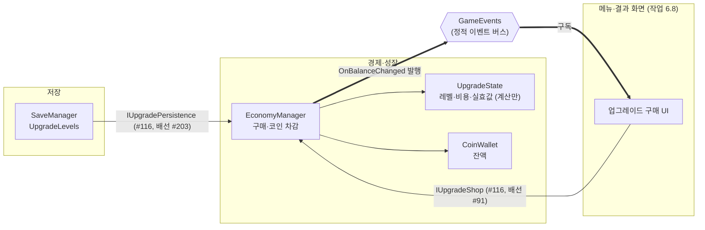

# 업그레이드

> 관련 이슈: #24, #32, #131, #140, #91, #203 · 최종 수정: 2026-09-21
**이 문서는 로그다.** 이 기능을 고칠 때마다 갱신한다. 새 문서를 만들지 않는다.

## 무엇을 하는가

업그레이드 4종의 레벨과 다음 레벨 비용을 계산하고, 코인을 받아 구매를 처리하며,
`upgrade_effects.csv` 의 효과를 얹은 **실효값**을 돌려준다.

계산 규칙 자체는 [BALANCE.md 6절](../BALANCE.md)이 정본이다. 여기서는 그것을 어떻게 구현했는지를 적는다.

**소비처는 #131 에서 연결됐다.** 스태미나·피버·망치·타격 대상·스폰이 `BalanceData` 기준값 대신
`IUpgradeStats.GetStat(stat, 기준값)` 을 읽는다. 배선 방식과 "다음 런부터" 규칙을 어떻게
보장하는지는 아래 "소비처에 닿는 길"에 있다.

**구매 화면은 #91(6.8)에서 붙었다.** `MainMenu` 씬의 `UpgradeShopPanel` 이 4종을 카드로 깔고
`IUpgradeShop` 으로 사고 읽는다 — 아래 "구매 화면" 절.

## 왜 이 방법인가

| 검토한 방법 | 채택 | 이유 |
|---|---|---|
| 계산부(`UpgradeState`)를 `EconomyManager` 에서 분리 | ✅ | Edit Mode 가 생명주기를 부르지 않아 계산을 MonoBehaviour 안에 두면 검증할 수 없다. `CoinWallet`·`StaminaPool`·`FeverGauge` 와 같은 이유 |
| 업그레이드 전용 매니저를 새로 만든다 | ❌ | 구매는 코인 차감과 한 덩어리다. 매니저를 나누면 "코인만 빠지고 레벨이 안 오르는" 창이 매니저 경계에 생긴다. ARCHITECTURE 1절도 "EconomyManager: 코인, 업그레이드 비용/레벨 계산"으로 묶어 두었다 |
| 런타임에 `BalanceData` 값을 직접 고쳐 효과 반영 | ❌ | CSV 산출물이라 손대지 않는다 (AGENTS.md). 한 번 고치면 다음 임포트까지 값이 어긋나고, 에디터에서 에셋이 dirty 로 남는다. **검증에 "dirty 가 아니다" 항목을 넣어 막아 두었다** |
| `GetStat(StatId)` — 기준값도 내부에서 조회 | ❌ | `spawn_count` 의 기준값은 `stages.csv` 의 **단계별** 값이라 `BalanceData` 한 곳에서 꺼낼 수 없다. 이 stat 하나 때문에 조회 경로가 두 갈래가 된다 |
| `GetStat(StatId, float baseValue)` — 기준값을 받는다 | ✅ | 호출측이 어차피 기준값을 들고 있다. BALANCE 6절 표를 코드에 복제하지 않아도 되고 단계별 값도 자연히 처리된다 |
| (6.8) 카드 4장을 패널이 **함께** 다시 그린다 | ✅ | 한 장을 사면 코인이 줄어 **다른 카드의 구매 가능 여부까지 달라진다.** 카드가 자기만 갱신하면 나머지는 살 수 있는 것처럼 남아, 눌러 보고서야 실패한다 |
| (6.8) 카드가 스스로 `EconomyManager` 를 찾는다 | ❌ | 같은 조회가 4번 일어나고 "누가 언제 잡았나"가 흩어진다. 패널이 한 번 잡아 `Bind` 로 넣어 준다 — 조립 지점을 한 곳으로 (ARCHITECTURE "SetBillService" 문단과 같은 성격) |
| (6.8) 효과 문구를 `upgrade_effects.csv` 의 `note` 열에서 읽는다 | ❌ | 임포터가 그 열을 읽지 않아 `UpgradeEffect` 에 없다. 읽게 하려면 `BalanceImporter` 와 생성 에셋 스키마를 바꿔야 해 공용 계약 변경이 된다 |
| (6.8) `StatId` → 한글 이름만 UI 에 두고 값은 CSV 에서 | ✅ | **숫자는 하나도 코드에 없다.** 값·단위·부호는 전부 `upgrade_effects.csv` 산출물에서 읽고, 표시 문자열만 UI 의 몫으로 둔다 (`UpgradeStatNames`) |
| (6.8) 살 수 없을 때 버튼만 비활성 | ❌ | 이슈 완료 기준이 "부족한 이유가 보이게" 다. 왜 못 사는지 모르면 코인을 더 모아야 하는지 최대 레벨인지 알 수 없다 |

### 비용 공식에서 `cost_growth` 0 의 뜻

`upgrades.csv` 의 네 종류가 전부 `cost_growth` 를 0 으로 두고 있다. 이건 "성장하지 않는다"가
아니라 **"공통값을 쓴다"** 는 뜻이며, 그때 `economy.csv` 의 `upgrade_cost_growth` 를 쓴다
(BALANCE 3절 "비용 성장률은 4종 공통이며 한 곳에서만 조정한다"). 종류별로 다르게 할 이유가
생기면 그 행에만 0 이 아닌 값을 넣으면 된다.

### percent 를 먼저, add 를 나중에

```
실효값 = 기준값 × (1 + percent 합 / 100) + add 합
```

순서를 바꾸면 더한 값에도 비율이 걸려 같은 레벨에서 다른 수가 나온다. `strong_hammer` 처럼
한 업그레이드가 `add`(타격 파워)와 `percent`(판정 반경)를 **서로 다른 stat 에** 갖는 경우가
있어 헷갈리기 쉽다 — 합산은 stat 별로 따로 한다.

## 구조



**점선은 더 이상 없다.** #116 이 만든 계약 둘 다 소비처가 생겼다 — `IUpgradeShop` 은
#91 의 구매 화면이, `IUpgradePersistence` 는 #203 의 저장 배선이 부른다. 후자는 복원이 앱
시작 1회, 저장이 고지서 화면을 떠날 때와 하루가 끝날 때다 ([저장·불러오기](save-load.md)).

| 클래스 | 경로 | 하는 일 |
|---|---|---|
| `UpgradeState` | `Assets/Scripts/Runtime/Economy/UpgradeState.cs` | 레벨 보유, 다음 비용, 실효값 계산. Unity 의존 없음 |
| `EconomyManager` | `Assets/Scripts/Runtime/Economy/EconomyManager.cs` | 구매(차감 + 레벨업), 조회 창구 |
| `UpgradeChecks` | `Assets/Scripts/Editor/UpgradeChecks.cs` | 계산부의 Edit Mode 검증 22건 |
| `UpgradeConsumerChecks` | `Assets/Scripts/Editor/UpgradeConsumerChecks.cs` | 실효값이 **소비처에 닿는지** 검증 13건 (#131) |
| `UpgradeShopPanel` | `Assets/Scripts/Runtime/UI/UpgradeShopPanel.cs` | 구매 화면. 서비스를 잡아 카드에 넣고, 잔액 표시와 전체 갱신을 맡는다 (#91) |
| `UpgradeShopEntry` | `Assets/Scripts/Runtime/UI/UpgradeShopEntry.cs` | 카드 한 장. 이름·설명·효과·레벨·다음 비용 표시, 구매 버튼, 못 사는 이유 (#91) |
| `UpgradeStatNames` | `Assets/Scripts/Runtime/UI/UpgradeStatNames.cs` | `StatId` → 한글 표시명. **수치는 없다** (#91) |
| (프리팹) | `Assets/Prefabs/UI/UpgradeShopPanel.prefab` | 패널 + 카드 4장. `MainMenu` 씬 Canvas 아래에 프리팹 인스턴스로 있다 |

### 이벤트

| 이벤트 | 발행/구독 | 언제 |
|---|---|---|
| `GameEvents.OnBalanceChanged` | `EconomyManager` 발행, `UpgradeShopPanel` 구독 | 구매가 **성공했을 때만**. 실패하면 발행하지 않는다 |

업그레이드 전용 이벤트는 만들지 않았다. #116 이 "6.8 담당자가 판단할 일"로 남겨 둔 질문인데,
**6.8 에서 필요 없다고 결론 났다.** 구매가 성공하면 코인이 반드시 줄고 그때 `OnBalanceChanged`
가 나가므로, 화면을 다시 그릴 신호로 그것만으로 충분하다. 구매 직후 갱신은 카드가 패널에
콜백으로 알려 이벤트를 거치지 않는다 — 같은 프레임에 두 번 그리지 않기 위해서다.

### 구매가 반쪽 나지 않게 하는 법

```
비용 조회 → 실패면 여기서 끝 (코인 손대지 않음)
지갑 차감 → 실패면 여기서 끝 (레벨 그대로)
레벨 +1  → 여기까지 왔으면 둘 다 성공
```

잔액 비교를 `EconomyManager` 에서 따로 하지 않고 `CoinWallet.TrySpendCoin` 하나에 맡긴다.
양쪽에서 비교하면 두 판단이 어긋날 수 있다.

### 구매 화면 (#91, 6.8)

~~`MainMenu` 씬 Canvas 아래에 `UpgradeShopPanel.prefab` 인스턴스가 있다.~~ #192 에서 고지서 패널의
업그레이드 탭으로 옮겼다 — `BillPanelController` 가 탭을 처음 펼칠 때 프리팹을 심는다.
**#184 부터 프리팹은 `UpgradeShopPrefabCreator`(`NCAI/UI/업그레이드 상점 프리팹 생성`) 산출물이다** —
손으로 고치지 않고 생성기를 고쳐 다시 만든다. 카드는 `BalanceData.Upgrades` 순서대로 만들고 id 를 심는다.

```
UpgradeShopPanel      서비스 조립 · 전체 갱신 (제목·잔고·닫기는 없다 — 탭 이름과 우상단 잔고가 그 역할)
└ Entries              ScrollRect (세로만, 휠) — #311 부터 행 목록
  ├ Viewport           RectMask2D
  │ └ Content          VerticalLayoutGroup(패딩 4, 간격 8) + ContentSizeFitter
  │   └ Card_<id> × N  UpgradeShopEntry — 한 행 1084×128. Surface #16130F + 패널 선
  │     ├ Head (240)   NameLabel 32 / LevelLabel 24
  │     ├ Body (남는 폭) DescriptionLabel 24 (2줄) / EffectLabel 24
  │     └ BuyRow (200) ReasonLabel 20 · PurchaseButton(Base: 테두리 이미지가 targetGraphic, 호버 금색) → Fill → Dollar · CostLabel
  └ Scrollbar          폭 16, 넘칠 때만 보인다 (AutoHideAndExpandViewport)
```

비주얼은 디자인 시스템 2차(2026-09-22)를 따른다 — 파란 버튼·`#262B3A` 카드 폐기, 구매 버튼은 Base 톤에
금색 숫자, 호버·눌림에서 테두리가 금색으로 바뀐다 (목업: [퍽 선택 · 업그레이드 탭 목업](https://claude.ai/artifact/1VHLpgcfwdRH4YAqt76RhW)).

- 서비스는 `EconomyManager.Shop`(`IUpgradeShop`)·`EconomyManager.Instance`(`IEconomyService`)로
  잡는다 — #171 이 연 통로다. 패널이 `OnEnable` 마다 다시 잡아 카드에 `Bind` 로 넣는다
  (매니저는 `DontDestroyOnLoad` 지만 패널은 씬과 함께 다시 생긴다)
- 표시 값은 전부 조회다. 이름·설명·최대 레벨은 `BalanceData`, 레벨·다음 비용은 `IUpgradeShop`,
  효과는 `UpgradeDef.Effects` — **UI 에 수치를 적어 두지 않는다** (#91 완료 기준)
- 못 사는 이유를 글로 보여준다. `GetNextCost` 가 `long.MaxValue` 면 `최대 레벨`,
  잔액이 모자라면 `코인 N 부족`. 그 `long.MaxValue` 는 숫자가 아니라 "더 살 수 없다"는 계약값이다
  (`EconomyManager.GetNextCost` 주석)
- 구매는 `IUpgradeShop.TryPurchase` 하나뿐이다. **UI 가 지갑을 직접 깎지 않는다** —
  차감은 그 안에서 `TrySpendCoin` 으로 일어난다 (AGENTS.md)

### 소비처에 닿는 길 (#131)

계약(`IUpgradeStats`)은 #116 이 만들었지만 **부르는 곳이 한 곳도 없었다.** 계산이 맞아도
읽는 쪽이 없으면 게임은 그대로다 — 업그레이드를 사도 코인과 레벨만 움직였다.

| 소비처 | 사는 곳 | 누가 넣어 주나 |
|---|---|---|
| `EconomyManager` (`coin_bonus_multiplier`, `fever_multiplier`) | Managers 프리팹 | 자기 자신이 공급자라 주입이 없다 |
| `StaminaManager`, `FeverManager` | Managers 프리팹 | `ManagerBootstrap` |
| `CreatureManager` | Managers 프리팹 | `ManagerBootstrap` (#140 에서 씬 → 프리팹으로 옮겼다) |
| `AutoHammerController` | Managers 프리팹 | `ManagerBootstrap` (#258 에서 뒤늦게 붙었다) |
| `HammerSwingController` | **씬** | `GameManager` (런 시작) |
| `Target` | 스폰된 인스턴스 | `CreatureManager` 가 `Initialize()` 전에 |

씬 소비처를 `ManagerBootstrap` 이 맡지 못하는 이유는 그것이 **씬 로드 전에** 돌기 때문이다.
`CreatureManager` 는 #140 에서 `Managers` 프리팹으로 옮겨 가 이 제약에서 벗어났고, 주입도
`ManagerBootstrap` 으로 넘어갔다. **`GameManager` 쪽에 남겨 두면 안 된다** — 프리팹에 있는 것을
씬 목록에도 넣으면 `BeginRun()` 이 두 경로로 불려 두 번째 호출이 퍼크 반경을 지운다.
`GameManager` 가 맡는 것은 ARCHITECTURE 가 "조립하는 지점(ManagerBootstrap 또는 GameManager
초기화) 한 곳만 구현 클래스를 알고, 그 뒤의 상호작용은 인터페이스로만 한다"고 정해 두었기 때문이다.

**주입이 없어도 죽지 않는다.** 모든 소비처가 `_upgradeStats == null` 이면 기준값을 그대로 쓴다 —
배선이 빠진 화면에서 게임이 멈추는 것보다 업그레이드만 안 먹는 편이 낫다.

### "다음 런부터"를 어떻게 지키나

BALANCE 6절이 "구매는 메뉴·결과 화면에서, 효과는 다음 런부터"라고 정했다. 호출 시점을 지키라고
당부하는 대신 **런 시작에 실효값을 굳혀** 구조로 만들었다 — `BeginRun()` 이 `GetStat` 을 부르고,
이후에는 굳힌 값만 쓴다. 런 도중에 레벨이 올라도 이번 런은 변하지 않는다.

예외가 하나 있다. `spawn_count` 는 **기준값이 단계마다 다르다**(`stages.csv`). 굳혀 두면 단계가
오를 때 옛 값이 남으므로 조회 시점에 계산한다. 여기서는 "레벨은 런 도중 바뀌지 않는다"는
규칙에 기댄다 — #116 이 기준값을 호출측이 넘기도록 계약을 정한 이유가 이 stat 이다.

배율 캐시에는 `_hasCachedMultipliers` 플래그를 따로 둔다. **0 을 "아직 안 채움"으로 쓸 수 없다** —
배율 0 은 코인을 통째로 없애는 값이라, 초기화 누락과 구별되지 않으면 수입이 조용히 사라진다.
실제로 이 플래그가 없을 때 `Awake` 가 돌지 않은 경로에서 지급액이 0 이 되는 것을 검증이 잡았다.

### 걷어낸 방식 — 조립 지점이 증분을 계산해 밀어 넣기

`CreatureManager.SetUpgradeOverrides(int bonusSpawnCount, float intervalMultiplier)` 가 있었다.
stat 마다 인자를 늘려야 하고(`+N` 이냐 `×배` 냐도 제각각), 무엇보다 업그레이드 반영 경로가
`IUpgradeStats` 와 **두 갈래**가 된다. #131 에서 걷어냈다.
`AutoHammerController.SetBonusCount(int)` 도 같은 방식이었는데 자동 망치(작업 3.2)의 몫이라
남겼다. **그것이 그대로 잊혔다** — 부르는 곳이 없는 채로 남아 상점에서 살 수는 있지만 게임에는
반영되지 않는 업그레이드가 됐고, #258 에서 `IUpgradeStats` 로 옮기며 제거했다.

### 저장 배열의 자리

`SaveData.UpgradeLevels` 는 `int[]` 이고 **`upgrades.csv` 의 `sort_order` 순**이다
(ARCHITECTURE "SaveData" 주석). 임포터가 `BalanceData.Upgrades` 를 `SortOrder` 로 정렬해 두므로
그 목록의 인덱스와 저장 배열의 인덱스가 같다. **`sort_order` 를 바꾸면 기존 저장 파일의
레벨이 다른 업그레이드에 붙는다** — 바꿀 때는 저장 버전도 함께 올려야 한다.

길이가 맞지 않으면 겹치는 만큼만 복원하고 경고를 남긴다. 최대 레벨을 넘거나 음수인 값은
잘라낸다 — 저장 파일은 손으로 고칠 수 있고 `max_level` 이 나중에 낮아질 수도 있다.

### 파산하면 사라진다 (#250, 4.16)

업그레이드는 **회차 층**이다. 파산하면 레벨이 0 으로 돌아가고, 파산을 넘어 남는 영구 성장은
레거시 포인트와 반지가 맡는다 (GDD "파산" 절 층 표, [레거시 포인트와 반지](legacy-points.md)).
원작도 같은 구조다 — 우리 업그레이드 4종은 원작의 분기형 스킬 트리를 축소한 것이지 반지가
아니고, 원작에서 스킬 트리는 파산으로 사라진다 ([REFERENCE_ANALYSIS](../REFERENCE_ANALYSIS.md) 대조표).

지우는 곳은 `BillManager.ResetRound` 하나다. 미납 파산과 자발적 파산이 둘 다
`HandleBankruptcy` → `ResetRound` 를 타므로 여기 한 곳만 보면 된다. 통로는 조립 지점
(`ManagerBootstrap`)이 넣어 주는 `IUpgradePersistence` 이고, 비우는 방법은
`RestoreUpgradeLevels(null)` 이다 — `UpgradeState.RestoreLevels` 가 null 을 받으면
레벨 배열을 통째로 `Array.Clear` 한다.

**지갑 초기화보다 먼저 부른다.** `RestoreWallet` 이 `OnBalanceChanged` 를 발행하고
`UpgradeShopPanel` 이 그것을 받아 카드를 다시 그리는데, `RestoreUpgradeLevels` 는 이벤트를
쏘지 않는다. 순서가 뒤집히면 이미 지워진 레벨이 화면에 옛 값으로 남는다. `BankruptcyChecks` 가
이 순서를 검증한다.

주입이 빠져도 `_upgradePersistence?.` 가 **조용히 건너뛴다** — 파산해도 업그레이드가 남는데
검증은 전부 통과하는 상태가 된다. 그래서 `BankruptcyChecks` 가 `ManagerBootstrap` 원문에
`SetUpgradePersistence(` 가 있는지까지 본다.

저장은 따로 손대지 않는다. `ResetRound` 는 메모리만 바꾸고, 다음 저장 시점에
`CurrentUpgradeLevels`(이미 0)가 그대로 담긴다 — `SaveData` 스키마가 그대로라 마이그레이션도
필요 없다.

### 읽는 밸런스 값

| CSV | 열 | 쓰는 곳 |
|---|---|---|
| `upgrades.csv` | `id`, `init_cost`, `cost_growth`, `max_level`, `sort_order` | 비용·상한·저장 자리 |
| `upgrades.csv` | `display_name`, `description` | 읽지 않는다 — UI(작업 6.8)의 몫 |
| `upgrade_effects.csv` | `upgrade_id`, `stat`, `effect_type`, `value_per_level` | 실효값 계산 |
| `economy.csv` | `upgrade_cost_growth` | `cost_growth` 가 0 일 때의 공통 성장률 |

## 검증

Edit Mode 에서 `UpgradeChecks.RunBatch()` 로 확인했다 (**22건 PASS**). 연속 3회 실행 후
`GameEvents` 구독자 수가 0 인 것도 확인했다. 기존 검증(경제 8 · 지갑 11 · 스태미나 22 ·
피버 23 · 타격 대상 25 · 계약)도 전부 통과한다.

기대값은 코드에 적지 않고 생성된 `BalanceData.asset` 에서 읽는다. **어떤 업그레이드가 어떤
stat 을 건드리는지도 CSV 에서 찾아 쓴다** — 종류가 바뀌어도 검증이 따라간다.

- [x] 레벨 배열 길이가 업그레이드 수와 같다 (저장 자리가 어긋나지 않는다)
- [x] 4종 전부 레벨 0 에서 비용이 `init_cost` 와 일치
- [x] 레벨이 오르면 `ceil(InitCost × growth^level)` 를 따르고 비용이 증가한다
- [x] `cost_growth` 0 이면 `economy.csv` 의 공통 성장률을 쓴다
- [x] 최대 레벨에서 비용이 나오지 않고 레벨업이 막힌다
- [x] 없는 id 는 레벨 0 / 비용 없음 / 레벨업 거부
- [x] 레벨 0 이면 모든 `StatId` 가 기준값 그대로
- [x] `add` 누적, `percent` 누적, **음수 percent 가 값을 줄인다**
- [x] 한 업그레이드가 stat 둘을 건드려도 서로 섞이지 않는다
- [x] 저장 왕복. 길이 불일치·null·최대 초과·음수를 모두 처리한다
- [x] `ToArray()` 가 복사본이라 밖에서 레벨을 바꿀 수 없다
- [x] **`BalanceData` 가 dirty 되지 않는다** (원본 불변)
- [x] 코인이 모자라면 구매 실패 — 레벨도 잔액도 그대로, `OnBalanceChanged` 미발행
- [x] 구매 성공 시 잔액이 정확히 비용만큼 줄고 `OnBalanceChanged` 가 한 번 나간다
- [x] 최대 레벨까지 사고 나면 코인이 남아도 더 못 산다
- [x] 없는 id 로 사려 해도 코인이 빠지지 않는다

### 소비처 배선 검증 (2026-09-17, #131)

`UpgradeConsumerChecks.RunBatch()` 로 확인했다 (**13건 PASS**).

여기서는 **실제 업그레이드 레벨을 쓰지 않고 스텁을 꽂는다.** `upgrade_effects.csv` 가 건드리는
stat 은 일부뿐이라(`max_stamina`·`fever_gauge_per_hit`·`coin_bonus_multiplier` 는 아직 아무
업그레이드도 올리지 않는다) 실제 레벨로 재면 그 소비처들은 영영 검증되지 않는다. 볼 것은
효과의 크기가 아니라 **소비처가 `GetStat` 을 거치는가**이므로 CSV 내용과 무관한 스텁이 더 정확하다.
실제 CSV 값으로 도는 경로는 `FeverPayoutChecks`·`CreatureMovementChecks` 가 본다.

- [x] 주입이 없으면 모든 소비처가 CSV 기준값 그대로다 (배선이 빠져도 죽지 않는다)
- [x] 최대 스태미나·초당 감소가 `GetStat` 을 거친다
- [x] 피버 누적량이 `GetStat` 을 거친다
- [x] 피버 지속 시간이 `GetStat` 을 거친다 — 기준 지속 시간이 지나도 아직 피버다
- [x] 타격력이 `GetStat` 을 거친다
- [x] 타격 대상의 판정 반경이 `GetStat` 을 거친다
- [x] **런 도중 레벨이 올라도 이번 런의 값은 그대로이고, 다음 런에서 반영된다**
- [x] 실행 후 `BalanceData` 가 dirty 가 아니고, 3회 연속 실행 뒤 구독자 수가 0
- [ ] `coin_bonus_multiplier` — **미검증.** `EconomyManager` 는 주입받는 쪽이 아니라 공급자라
      스텁을 꽂을 수 없고, 그 stat 을 올리는 업그레이드도 CSV 에 없다. 검증이 조용히 건너뛰지
      않도록 로그를 남기고, 효과가 추가되면 저절로 켜진다

검증이 실제로 무언가를 잡는지도 확인했다. `StaminaManager` 의 `GetStat` 을 기준값 반환으로
되돌려 보니 "최대 스태미나가 GetStat 을 거치지 않습니다"로 실패했다.

**미검증**: Play Mode. Unity 가 실제로 그 시점에 생명주기를 불러 주는지, `GameManager` 가 씬
소비처를 제때 찾는지는 확인하지 못했다 — 검증에서는 주입을 직접 부른다.

### 구매 화면 Play Mode 검증 (2026-09-18, #91)

**"사면 다음 런에 세진다"를 처음으로 게임에서 확인했다.** 구매 화면이 없어 못 하던 것이다.

| 확인한 것 | 결과 |
|---|---|
| 코인 0 | 4장 모두 버튼 비활성, `코인 50/75/100/120 부족` 표시 |
| `AddCoin(200)` | `OnBalanceChanged` 로 4장이 함께 갱신되어 전부 구매 가능, 잔액 표시 `200` |
| 카드 버튼 클릭 (`desk_expand`, 120) | 레벨 0 → 1 · 비용 120 → **138** · 잔액 200 → 80 |
| 같은 클릭 뒤 **다른 카드** | `fever_boost`(100) 가 `코인 20 부족` 으로 비활성 — 산 카드만이 아니라 전부 재계산된다 |
| 최대 레벨 (`auto_hammer` 10회 구매) | `Lv 10 / 10` · 비용 표시 `—` · 버튼 비활성 · `최대 레벨` |
| **다음 런 반영** | `strong_hammer` 4레벨 구매 → 런 도중에는 `_runHitPower` 가 1 그대로, 런을 다시 시작하니 **2.4** (= 1 + 0.35×4, BALANCE 6절) |

에디터 콘솔 오류·경고 0건. 전체 검증 하네스(`ValidationRunner.RunAll`)도 실패 0.

## 알려진 한계

- ~~**납부 후 스킬 트리 유도는 아직 없다 (#249).**~~ — #249에서
  새 고지서 화면의 `아직` 버튼 클릭 시 스킬 트리 탭으로 즉시 이동하고, 최초 1회 남은 코인 투자 안내 팝업을
  표시하도록 연결 완료.

- ~~**효과가 대부분 게임에 반영되지 않는다.**~~ — #131 에서 소비처를 연결했다. 남은 것은
  `auto_hammer_count`(#258 에서 붙였다)와 조준 원 반경(#132)뿐이었다
- ~~**Play Mode 로 "사면 다음 런에 세진다"를 본 사람이 아직 없다.**~~ — #91 에서 구매 화면이
  생겨 확인했다 (위 "구매 화면 Play Mode 검증")
- ~~**저장·복원이 연결되지 않았다.**~~ — #203 에서 배선했다. `ManagerBootstrap` 이 `SaveManager` 에 `IUpgradePersistence` 를 주입하고, 복원은 앱 시작 1회·저장은 고지서 화면을 떠날 때와 하루 종료 시다. 업그레이드 레벨이 앱을 껐다 켜도 남는다 ([저장·불러오기](save-load.md)).
- **구매 시점을 강제하지 않는다.** "메뉴·결과 화면에서만, 다음 런부터 반영"(BALANCE 6절)은
  호출측 책임으로 두었다. 런 상태를 매니저가 알면 GameManager 를 직접 참조하게 된다
- ~~**`auto_hammer_count` 를 쓰는 곳이 아직 없다.**~~ — [#258](https://github.com/KDNA-Gwangju-1/NCAIClicker/issues/258)
  에서 붙였다. `SetBonusCount(int)` 를 걷어내고 `BeginRun` 이 `GetStat(AutoHammerCount)` 를 굳히며,
  주입은 `ManagerBootstrap.WireUpgradeStats` 가 다른 프리팹 소비처와 같은 자리에서 넣는다.
  발견 경위: #91 확인 중 `auto_hammer` 를 Lv 10 까지 사도 `_bonusCount` 가 0 그대로인 것을 실측했는데,
  담을 카드가 3.2(이미 닫힘)로 지목돼 있어 한동안 문서에만 남아 있었다. **상점에서는 살 수 있지만
  게임에는 반영되지 않는 업그레이드였다** — 주입이 없으면 기준값으로 조용히 폴백하는 설계라
  아무 검증도 걸리지 않았다. 같은 사고를 막으려고 `UpgradeConsumerChecks` 가 `ManagerBootstrap`
  원문에서 소비처 넷의 주입을 직접 확인한다
- **`auto_hammer_power`·`auto_hammer_hits_per_sec` 는 업그레이드를 받지 않는다.** 한계가 아니라
  설계다 — 이 업그레이드의 축은 수량 하나이고 기당 주기·파워는 기본값을 유지한다 (GDD 5절)
- **조준 원 반경은 업그레이드를 받지 않는다.** `economy.csv` 의 `reticle_radius` 로 옮겼고
  ([#132](https://github.com/KDNA-Gwangju-1/NCAIClicker/issues/132)), `hit_radius`(대상 콜라이더
  확대)와는 다른 축이다. 두 축에 같은 업그레이드를 걸면 효과가 두 번 곱해진다 (BALANCE 6절 표)

### #247 부업 장부(코인 배율) 추가와 카드 5장 배치 (2026-09-23)

* `upgrades.csv` 에 `coin_bonus`(부업 장부) 행을 추가했다 — 초기 50 · 단가 1.5배 · 최대 30레벨, 효과 `coin_bonus_multiplier` +1.0/Lv. 원작 고지서 11장에 수입 곡선을 맞추는 후반 성장 엔진이다 (근거 BALANCE.md "고지서 — 원작 고지서 11장"). 코드는 고치지 않았다 — `EconomyManager` 가 이 stat 을 이미 업그레이드 실효값으로 읽는다. `UpgradeConsumerChecks` 의 배율 검증이 "해당 업그레이드 없음" 건너뛰기에서 실제 검증으로 켜졌다
* `economy.csv` `upgrade_cost_growth` 1.15 → 1.3 (나머지 4종의 단가)
* 업그레이드 탭 카드 배치: 2열 534×328 → **3열 × 2행, 카드 350×328**. 이름 40 → 32px, Lv 칸 160 → 110(22px), 설명·효과 22 → 20px. 시안 비교(A안 3×2 / B안 2×3)는 PR 에 남기고, 구현했으므로 목업 파일은 README 규칙대로 지웠다
* `UpgradeShopPrefabCreator` 도 같은 값으로 고쳤다 — 카드 수는 원래 `upgrades.csv` 행 수를 따르므로 다시 생성해도 5장이 나온다. 이번에는 #184 디자인 조정을 잃지 않도록 프리팹을 다시 만들지 않고 MCP 로 고쳤다 (카드 복제 → `_upgradeId: coin_bonus`, 패널 `_entries` 5개)
* **개선 예정 (PM):** 좁아진 카드에서 설명이 빡빡하다 — [#311](https://github.com/KDNA-Gwangju-1/NCAIClicker/issues/311)
* [x] `NCAI > 전체 검증 실행` 29/29 (UI 가이드라인 포함)

### #311 카드 격자 → 행 목록 + 스크롤 (2026-09-23)

3열 격자는 카드가 늘 때마다 칸이 좁아진다. 5장에서 이미 설명·효과가 20px 로 줄고 이름·부족 사유가 꺾였다.
시안 셋을 1100×760 단위로 비교해 **B안(가로 행 목록 + 세로 스크롤)** 을 골랐다.

| 안 | 버린 이유 / 고른 이유 |
|---|---|
| A 현재 격자 | 7장부터 3행이 되어 칸을 넘친다. 글자를 더 줄일 곳이 없다 (UI_GUIDE 캡션 하한 20px) |
| **B 행 목록** | 한 행 폭이 1084 라 설명·효과를 본문 24px 로 올릴 수 있다. 몇 장이 되든 스크롤이 받는다 |
| C 목록 + 상세 | 한 번에 한 장만 자세히 보인다 — 업그레이드끼리 가격·효과를 나란히 비교하지 못한다 |

- **5장은 스크롤 없이 한 화면에 든다**: 패딩 4 + 128×5 + 간격 8×4 + 4 = 680 = 뷰포트 높이. 6장부터 스크롤바가 생긴다
- 자르는 건 `RectMask2D` 다. `Mask` 는 스텐실용 Image 가 필요하다
- **함정 1 — 가운데 칸의 선호 폭**: `VerticalLayoutGroup` 칸은 자식 글자의 한 줄 길이를 선호 폭으로 보고한다.
  설명이 길면 세 칸의 선호 폭 합이 행 폭을 넘고, 부모는 **좌우 고정 칸까지** 비율로 줄인다 (카드마다 이름 칸이 204~264 로 흔들렸다).
  가운데 칸 `LayoutElement.preferredWidth = 0` 으로 끊었다
- **함정 2 — 칸의 유연폭**: 칸 안 `childForceExpandWidth = true` 때문에 그룹이 유연폭 1 을 보고해 고정 칸도 남는 폭을 나눠 가진다
  (420 / 180 / 380 으로 갈렸다). `CreateColumn` 이 `flexibleWidth = 0` 으로 막는다
- **함정 3 — Outline 잘림**: 카드 테두리는 `Outline`(±2px) 이라 뷰포트 경계에서 잘린다. Content 패딩 4 가 그 몫이다
- 에디터 Play 에서 처음 한 번 카드가 **청록색 사각형**으로 보일 수 있다. 에디터 비동기 셰이더 컴파일이
  `RectMask2D` 용 클립 변형을 만드는 동안 쓰는 임시 색이고, 컴파일이 끝나면 정상으로 그려진다. 빌드에서는 생기지 않는다
- 런타임 코드(`UpgradeShopPanel`·`UpgradeShopEntry`)는 고치지 않았다 — 라벨 참조만 쓰므로 배치가 바뀌어도 그대로다.
  `BillPanel.prefab` 은 이 프리팹을 인스턴스로 심으므로 다시 만들 필요가 없다
- 시안 HTML 은 README 규칙대로 지웠다

**검증 (2026-09-23, 에디터 Play · Game 씬 · 1280×720)**

| 확인한 것 | 결과 |
|---|---|
| 5장 | 뷰포트 1084×680 · 콘텐츠 680 · 스크롤바 꺼짐 · 세 칸 240/540/200 전 카드 동일 · TMP 넘침 0 · 설명 2줄(카페인 중독만 1줄) |
| 카드 1장 런타임 복제(6장) | 콘텐츠 816 · 스크롤바 켜짐 · 핸들 0.83(=680/816) · 뷰포트 1084 → 1064 (폭 16 + 간격 4) |
| `NCAI > 전체 검증 실행` | Checks 30줄 PASS, 에러 0. UI 가이드라인 권장 사항 32건 중 UpgradeShopPanel 항목 0건 |

## 갱신 이력

| 날짜 | 이슈 | 누가 | 무엇이 바뀌었나 |
|---|---|---|---|
| 2026-09-17 | #24 | twins6375-art | 최초 작성 (레벨·비용 공식, 실효값 계산, 구매) |
| 2026-09-17 | #32 | twins6375-art | `fever_multiplier` 가 실제로 소비되기 시작한 것을 반영 (소비처 한계 축소) |
| 2026-09-17 | #131 | twins6375-art | 소비처 6곳을 `IUpgradeStats` 로 연결. 런 시작 캐시로 "다음 런부터" 보장, push 방식 `SetUpgradeOverrides` 제거 |
| 2026-09-17 | #140 | saltlake00 | `CreatureManager` 가 `Managers` 프리팹으로 옮겨 가 주입 주체가 `GameManager` → `ManagerBootstrap` 으로 바뀐 것을 반영 |
| 2026-09-18 | #91 | yahoo-afk | 구매 화면(6.8) 추가 — `UpgradeShopPanel`/`UpgradeShopEntry`/`UpgradeStatNames` 와 `MainMenu` 씬 배치. #171 이 연 `EconomyManager.Shop` 통로를 첫 소비. "다음 런부터" 를 Play Mode 로 처음 확인 |
| 2026-09-21 | #203 | twins6375-art | `IUpgradePersistence` 가 `SaveManager` 에 배선되어 구조 도식의 점선 하나가 실선이 됐다. 업그레이드 레벨이 앱을 껐다 켜도 남는다 |
| 2026-09-22 | #184 | saltlake00 | 구매 화면 비주얼을 디자인 시스템 2차로 교체. `UpgradeShopPrefabCreator` 신설 → 프리팹 재생성(카드 2×2, Base 구매 버튼 + 호버 금색 테두리). 런타임 로직 변경 없음 |
| 2026-09-22 | #250 | yahoo-afk | 업그레이드를 영구 층에서 **회차 층**으로 이관 (4.16, 팀장 결정). `BillManager.ResetRound` 가 `IUpgradePersistence.RestoreUpgradeLevels(null)` 로 비운다. 레거시 포인트·반지는 그대로 영구 층 |
| 2026-09-22 | #249 | saltlake00 | 새 고지서의 `아직` 버튼을 스킬 트리 탭으로 연결하고 최초 1회 투자 안내 팝업 배선 완료 |
| 2026-09-22 | #258 | yahoo-afk | 자동 망치를 `IUpgradeStats` 로 연결 (3.12). push 통로 `SetBonusCount` 제거, `BeginRun` 이 보유 수를 굳힌다. `UpgradeConsumerChecks` 에 자동 망치 3건과 조립 지점 원문 확인 1건 추가 |
| 2026-09-23 | #247 | saltlake00 | 부업 장부(`coin_bonus`) 추가, 단가 성장 1.3, 업그레이드 탭 3열×2행 배치 |
| 2026-09-23 | #311 | soilrist | 업그레이드 탭을 3열 격자에서 행 목록 + 세로 스크롤로 교체 (B안). 설명·효과 20 → 24px. 레이아웃 함정 3가지와 Play 검증 기록 |
