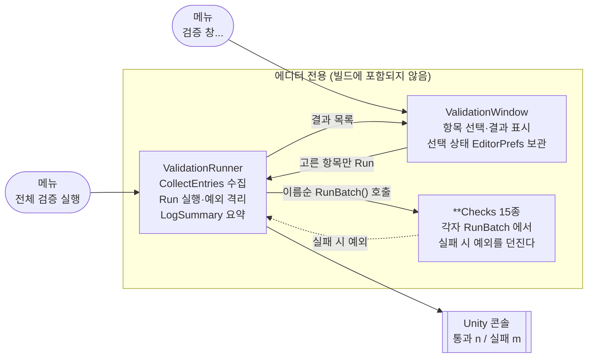

# 에디터 검증 하네스

> 관련 이슈: #159 · 최종 수정: 2026-09-18

**이 문서는 로그다.** 이 기능을 고칠 때마다 갱신한다. 새 문서를 만들지 않는다.

## 무엇을 하는가

`Assets/Scripts/Editor/*Checks.cs` 는 각 기능이 실제로 의도대로 도는지 에디터에서 실행해
확인하는 검증 하네스다. 진입점은 둘이다.

| 메뉴 | 쓰임 |
|---|---|
| `NCAI > 전체 검증 실행` | 15종을 확인 없이 바로 돌린다. PR 올리기 전 한 번 |
| `NCAI > 검증 창...` | 돌릴 항목을 골라서 돌린다. 한 모듈만 고쳤을 때 |

하네스는 실패를 **예외로 던진다.** 반환값으로 성공 여부를 알리지 않는다.

## 왜 이 방법인가

#159 이전에는 하네스 15개 중 `MenuItem` 이 붙은 3개(`CreatureMovementChecks`,
`HammerSwingChecks`, `TargetChecks`)만 실행할 수 있었다. 나머지 12개는 `RunBatch()` 가
`public static` 인데 메뉴 항목도 호출부도 없어, 각 PR 작업 중 MCP `execute_code` 로 한 번
돌리고 끝난 일회용이 되어 있었다. 약 180KB 분량의 검증 로직을 팀이 쓸 수 없었다.

### 수집 방식

| 검토한 방법 | 채택 | 이유 |
|---|---|---|
| 리플렉션으로 `*Checks` 를 모은다 | ✅ | 새 하네스를 추가해도 러너·창을 고칠 필요가 없다. 지금처럼 다시 죽는 것을 구조적으로 막는다 |
| 15개 파일에 `MenuItem` 을 하나씩 추가 | ❌ | 기존 파일을 전부 건드려야 하고, 앞으로 하네스를 추가할 때마다 사람이 기억해야 한다. **기억에 기대는 규칙은 지금 이 문제를 만든 원인이다** |
| 러너에 클래스 목록을 배열로 박아 둠 | ❌ | 위와 같다. 목록을 갱신하지 않으면 새 하네스가 조용히 빠진다 |
| PlayMode 테스트(`Assets/Tests/`)로 이전 | ❌ | 하네스가 `AssetDatabase`·`PrefabUtility` 등 에디터 전용 API 에 의존한다. 이전 비용이 크고 이번 이슈 범위 밖이다 |

### 왜 창까지 만들었나

15종을 전부 도는 데는 시간이 걸린다. 경제 쪽만 고쳤는데 크리처 이동 검증까지 기다려야 하면
**결국 검증을 안 돌리게 된다.** 전부 아니면 전무인 도구는 쓰이지 않는다.

창은 그 밖에 두 가지를 더 해결한다.

- 실패 사유를 **창 안에** 보여 준다. 콘솔에서 찾게 하면 한 단계가 늘고 다른 로그에 묻힌다
- 검증 메뉴 항목 3개를 흡수해 `NCAI` 메뉴가 7줄에서 5줄로 줄었다

창이 개별 `MenuItem` 3개를 완전히 대체하므로 그 3개는 **뗐다.** 하네스 자체는 그대로 있고
러너·창이 똑같이 호출한다.

### 메뉴 순서

`MenuItem` 에 `priority` 를 주지 않으면 **등록 순서대로** 붙어 의도 없이 섞인다.
#159 이전의 `NCAI` 메뉴가 그 상태였다.

값을 각 파일에 흩어 두면 같은 문제가 다시 생기므로 `MenuPriority` 한곳에서만 정한다.
Unity 는 priority 가 **11 이상 벌어지면 구분선**을 넣으므로, 묶음 사이를 그만큼 띄운다.

```
NCAI
  밸런스 CSV 임포트   Ctrl+Shift+I      (1)   데이터
  ─────────────
  검증 창...                            (20)  검증
  전체 검증 실행                        (21)
  ─────────────
  PC 초기 설정 적용                     (40)  환경
```

## 구조



| 클래스 | 경로 | 하는 일 |
|---|---|---|
| `ValidationRunner` | `Assets/Scripts/Editor/ValidationRunner.cs` | 수집·실행·요약. 창과 공유한다 |
| `ValidationWindow` | `Assets/Scripts/Editor/ValidationWindow.cs` | 항목 선택 UI. 실행은 러너에 맡긴다 |
| `MenuPriority` | `Assets/Scripts/Editor/MenuPriority.cs` | `NCAI` 메뉴 표시 순서 |
| `*Checks` 15종 | `Assets/Scripts/Editor/*Checks.cs` | 각 기능의 검증 본체 |

**수집과 실행을 창이 따로 구현하지 않는다.** 규칙이 두 곳으로 갈라지면 창에는 보이는데
전체 실행에서는 빠지는 하네스가 생긴다.

### 수집 조건

`CollectEntries()` 는 자기 어셈블리(`Assembly-CSharp-Editor`)에서 아래를 **전부** 만족하는
것만 모은다. 하나라도 어긋나면 조용히 빠지므로, 새 하네스를 만들 때 맞춰야 한다.

- `static` 클래스 (`IsAbstract && IsSealed`)
- 이름이 `Checks` 로 끝난다
- 매개변수 없는 `public static` `RunBatch()` 를 가진다

실행 순서는 클래스 이름의 서수 정렬로 고정했다. 돌릴 때마다 콘솔 로그가 같은 차례로
쌓여야 diff 를 눈으로 비교할 수 있다.

### 예외 격리

`MethodInfo.Invoke` 는 대상이 던진 예외를 `TargetInvocationException` 으로 감싼다.
그대로 보고하면 콘솔에 "호출 대상이 예외를 던졌습니다"만 남고 **실제 실패 사유가 사라진다.**
그래서 `InnerException` 을 꺼내 보고한다.

한 하네스가 던져도 나머지는 계속 돈다. 첫 실패에서 멈추면 한 번 돌릴 때 문제 하나씩만
알게 되고, 에디터 검증은 한 번 도는 데 시간이 걸린다.

### 선택 상태 보관

창은 `EditorPrefs` 에 **해제한 항목만** 적어 둔다 (`NCAIClicker.ValidationWindow.Unselected`).
선택한 쪽을 저장하면 나중에 추가된 하네스가 기본 해제로 보여 조용히 빠진다.
**새 하네스는 기본으로 돌아야 한다.**

### 이벤트

발행·구독하는 `GameEvents` 이벤트가 없다. 에디터 도구이며 런타임 흐름에 끼어들지 않는다.

다만 하네스 본체들은 `GameEvents` 를 직접 발행·구독해 검증한다. 하네스가 남긴 구독이
에디터 세션에 남지 않도록 `GameEvents.ResetAll()` 로 정리하는 것은 **각 하네스의 책임**이고
러너가 대신 해 주지 않는다.

### 읽는 밸런스 값

러너·창 자신은 CSV 를 읽지 않는다. 하네스 본체들이
`Assets/GameData/Generated/BalanceData.asset` 을 통해 읽으므로, **검증 전에 밸런스 CSV
임포트(Ctrl+Shift+I)가 끝나 있어야 한다.** `BalanceImporterChecks` 는 스스로 임포트를 수행한다.

## 검증

Edit Mode 에서 실제로 확인했다.

- [x] `NCAI > 전체 검증 실행` — `[ValidationRunner] 통과 15 / 실패 0 (전체 15)`
- [x] **실패 경로 실측** — `CoinWalletChecks`(순서 3번째)에 임시 예외를 심고 실행한 결과
      `통과 14 / 실패 1`, `- CoinWalletChecks: 실패 경로 실측용 임시 예외`.
      `InnerException` 이 꺼내져 실제 사유가 보였고, 뒤이은 12개가 계속 돌았다. 임시 예외는 원복했다
- [x] `NCAI > 검증 창...` 이 열리고 15종을 이름순으로 수집한다
- [x] 선택 실행 — 경제 3종(`BalanceImporterChecks`·`CoinWalletChecks`·`EconomyManagerChecks`)만
      골라 돌려 3종만 실행되는 것을 확인
- [x] 메뉴 우선순위가 의도대로 (`1`, `20`, `21`, `40`)
- [x] 컴파일 오류·경고 0건
- [x] 하네스 본체(`*Checks.cs`) 로직 무변경 — 뗀 것은 `MenuItem` 속성 3줄뿐

## 알려진 한계

- **CI 에서 돌지 않는다.** 사람이 Unity 를 열고 메뉴를 눌러야 한다. PR 마다 자동으로 돌지
  않으므로, 러너가 있다는 사실만으로 회귀가 막히지는 않는다. 배치 모드
  (`-executeMethod NCAIClicker.EditorTools.ValidationRunner.RunAll`)로 부를 수는 있으나 배선하지 않았다.
- ~~**검증 실행 중 `Destroy may not be called from edit mode` 오류가 상시 뜬다.**~~ — #161 에서
  `CreatureManager` 에 `SafeDestroy` (`Application.isPlaying ? Destroy : DestroyImmediate`) 를
  도입하여 해결했다. 에디트 모드 검증 중 정리되지 않은 오브젝트가 씬에 남아 하네스를 오염시키는
  문제가 완전히 차단되었다.
- **씬·플레이 모드를 건드리는 검증은 포함하지 않는다.** PlayMode 테스트는
  `Assets/Tests/PlayMode/` 에 따로 있고 러너가 그쪽을 실행하지 않는다.
- 하네스가 만든 `HideFlags.HideAndDontSave` 오브젝트 정리는 각 하네스 책임이다. 러너는
  하네스 사이에 씬 상태를 초기화하지 않는다.
- 창은 도메인 리로드 후에도 살아남지만 목록을 자동으로 다시 모으지 않는다. 새 하네스를
  만든 직후에는 **다시 수집** 버튼을 눌러야 보인다.

## 갱신 이력

| 날짜 | 이슈 | 누가 | 무엇이 바뀌었나 |
|---|---|---|---|
| 2026-09-18 | #159 | saltlake00 | 최초 작성. `ValidationRunner` 신설로 실행할 수 없던 하네스 12종을 되살림 |
| 2026-09-18 | #159 | saltlake00 | `ValidationWindow`(항목 선택 실행)와 `MenuPriority`(메뉴 순서) 추가, 검증 `MenuItem` 3개를 창으로 흡수, 실패 경로 실측 |
| 2026-09-18 | #161 | saltlake00 | `CreatureManager` 에디트 모드 Destroy 오류 해결 및 잔류 방지 (#161) 반영 |
