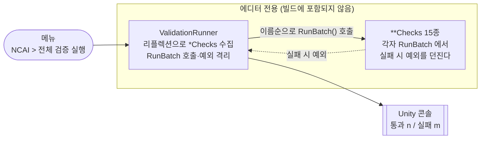

# 에디터 검증 하네스

> 관련 이슈: #159 · 최종 수정: 2026-09-18

**이 문서는 로그다.** 이 기능을 고칠 때마다 갱신한다. 새 문서를 만들지 않는다.

## 무엇을 하는가

`Assets/Scripts/Editor/*Checks.cs` 는 각 기능이 실제로 의도대로 도는지 에디터에서 실행해
확인하는 검증 하네스다. `ValidationRunner` 는 그 하네스를 전부 모아 한 번에 돌리고
통과·실패를 한 줄로 요약한다. 메뉴 `NCAI > 전체 검증 실행` 이 진입점이다.

하네스는 실패를 **예외로 던진다.** 반환값으로 성공 여부를 알리지 않는다.

## 왜 이 방법인가

#159 이전에는 하네스 15개 중 `MenuItem` 이 붙은 3개(`CreatureMovementChecks`,
`HammerSwingChecks`, `TargetChecks`)만 실행할 수 있었다. 나머지 12개는 `RunBatch()` 가
`public static` 인데 메뉴 항목도 호출부도 없어, 각 PR 작업 중 MCP `execute_code` 로 한 번
돌리고 끝난 일회용이 되어 있었다. 약 180KB 분량의 검증 로직을 팀이 쓸 수 없었다.

| 검토한 방법 | 채택 | 이유 |
|---|---|---|
| 리플렉션으로 `*Checks` 를 모아 도는 러너 1개 | ✅ | 새 하네스를 추가해도 러너를 고칠 필요가 없다. 지금처럼 다시 죽는 것을 구조적으로 막는다 |
| 15개 파일에 `MenuItem` 을 하나씩 추가 | ❌ | 기존 파일 15개를 전부 건드려야 하고, 앞으로 하네스를 추가할 때마다 사람이 기억해야 한다. **기억에 기대는 규칙은 지금 이 문제를 만든 원인이다** |
| 러너에 클래스 목록을 배열로 박아 둠 | ❌ | 위와 같다. 목록을 갱신하지 않으면 새 하네스가 조용히 빠진다 |
| PlayMode 테스트(`Assets/Tests/`)로 이전 | ❌ | 하네스가 `AssetDatabase`·`PrefabUtility` 등 에디터 전용 API 에 의존한다. 이전 비용이 크고 이번 이슈 범위 밖이다 |

기존 `MenuItem` 3개는 **그대로 두었다.** 하나만 빨리 돌리고 싶을 때 쓰인다.
러너는 그 3개도 똑같이 `RunBatch()` 로 호출하므로 중복 정의가 생기지 않는다.

## 구조

| 클래스 | 경로 | 하는 일 |
|---|---|---|
| `ValidationRunner` | `Assets/Scripts/Editor/ValidationRunner.cs` | `*Checks` 수집·실행·요약. 유일한 신규 파일 |
| `*Checks` 15종 | `Assets/Scripts/Editor/*Checks.cs` | 각 기능의 검증 본체. 이번 이슈에서 수정하지 않았다 |

### 수집 조건

`ValidationRunner` 는 자기 어셈블리(`Assembly-CSharp-Editor`)에서 아래를 **전부** 만족하는
것만 모은다. 하나라도 어긋나면 조용히 빠지므로, 새 하네스를 만들 때 맞춰야 한다.

- `static` 클래스 (`IsAbstract && IsSealed`)
- 이름이 `Checks` 로 끝난다
- 매개변수 없는 `public static` `RunBatch()` 를 가진다

실행 순서는 클래스 이름의 서수 정렬로 고정했다. 돌릴 때마다 콘솔 로그가 같은 차례로
쌓여야 diff 를 눈으로 비교할 수 있다.

### 예외 격리

`MethodInfo.Invoke` 는 대상이 던진 예외를 `TargetInvocationException` 으로 감싼다.
그대로 보고하면 콘솔에 "호출 대상이 예외를 던졌습니다"만 남고 **실제 실패 사유가 사라진다.**
그래서 `InnerException` 을 꺼내 보고한다.

한 하네스가 던져도 나머지는 계속 돈다. 첫 실패에서 멈추면 한 번 돌릴 때 문제 하나씩만
알게 되고, 에디터 검증은 한 번 도는 데 시간이 걸린다.

### 이벤트

발행·구독하는 `GameEvents` 이벤트가 없다. 에디터 도구이며 런타임 흐름에 끼어들지 않는다.

다만 하네스 본체들은 `GameEvents` 를 직접 발행·구독해 검증한다. 하네스가 남긴 구독이
에디터 세션에 남지 않도록 `GameEvents.ResetAll()` 로 정리하는 것은 **각 하네스의 책임**이고
러너가 대신 해 주지 않는다.

### 읽는 밸런스 값

러너 자신은 CSV 를 읽지 않는다. 하네스 본체들이 `Assets/GameData/Generated/BalanceData.asset`
을 통해 읽으므로, **검증 전에 밸런스 CSV 임포트(Ctrl+Shift+I)가 끝나 있어야 한다.**
`BalanceImporterChecks` 는 스스로 임포트를 수행한다.

## 검증

Edit Mode 에서 실제로 확인했다.

- [x] 메뉴 `NCAI > 전체 검증 실행` 이 보이고 동작한다
- [x] `[ValidationRunner] 통과 15 / 실패 0 (전체 15)` — 15종이 전부 호출되고 전부 통과
- [x] 컴파일 오류·경고 0건
- [x] 기존 `*Checks.cs` 에 변경 없음 (`git diff` 로 확인)
- [ ] **미검증** — 하네스가 예외를 던졌을 때 나머지가 계속 도는 동작. 현재 15종이 전부
      통과하므로 실패 경로를 실제로 밟히지 못했다. `try/catch` 로 감싸 두었으나 실측은 아니다

## 알려진 한계

- **실패 경로가 실측되지 않았다.** 위 검증의 마지막 항목을 보라. 처음으로 하네스가 깨지는
  날에 이 경로가 처음 실행된다.
- **CI 에서 돌지 않는다.** 사람이 Unity 를 열고 메뉴를 눌러야 한다. PR 마다 자동으로 돌지
  않으므로, 러너가 있다는 사실만으로 회귀가 막히지는 않는다. 배치 모드(`-executeMethod
  NCAIClicker.EditorTools.ValidationRunner.RunAll`)로 부를 수는 있으나 배선하지 않았다.
- **씬·플레이 모드를 건드리는 검증은 포함하지 않는다.** PlayMode 테스트는
  `Assets/Tests/PlayMode/` 에 따로 있고 러너가 그쪽을 실행하지 않는다.
- 하네스가 만든 `HideFlags.HideAndDontSave` 오브젝트 정리는 각 하네스 책임이다. 러너는
  하네스 사이에 씬 상태를 초기화하지 않으므로, 정리를 빠뜨린 하네스는 다음 하네스를 오염시킨다.

## 갱신 이력

| 날짜 | 이슈 | 누가 | 무엇이 바뀌었나 |
|---|---|---|---|
| 2026-09-18 | #159 | saltlake00 | 최초 작성. `ValidationRunner` 신설로 실행할 수 없던 하네스 12종을 되살림 |
