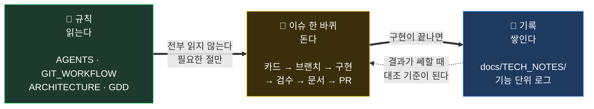
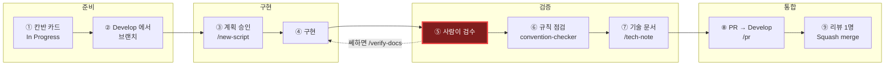
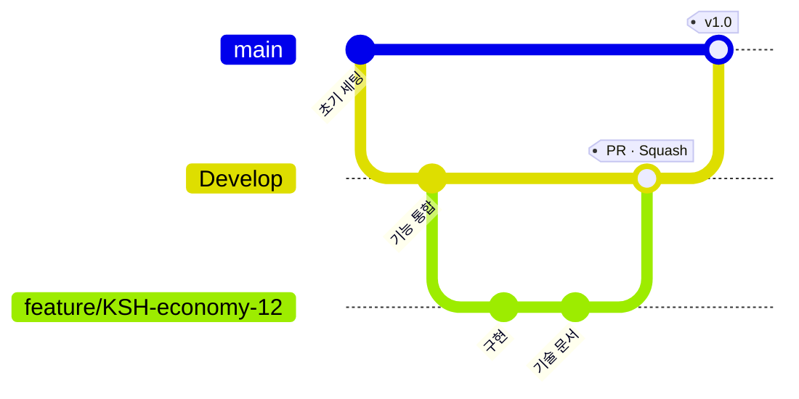
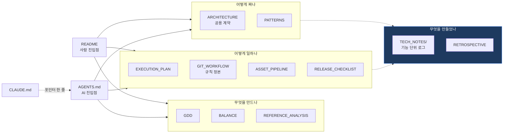

# 작업 흐름 도식

말로 적으면 긴 것들을 그림으로 모아 둔 페이지다. **규칙의 정본이 아니다** —
브랜치·커밋·PR 규칙은 [GIT_WORKFLOW.md](GIT_WORKFLOW.md), 작업 지침은 [AGENTS.md](../AGENTS.md)에 있다.

## 1. 전체 구조 — 읽는다 / 돈다 / 쌓인다

규칙은 **바뀌면 한 곳만 고친다.** 기록은 **팀이 같이 갱신한다.**

## 2. 이슈 한 바퀴

**⑤ 검수만은 사람이 한다.** 한두 번 건너뛰면 컨벤션은 맞는데 어떤 논리로 만들었는지
아무도 모르는 코드가 쌓이고, 그때부터 수정·버그픽스의 **작업 일정을 말할 수 없게 된다.**

## 3. 브랜치

`main` 은 배포 가능한 상태만 담는다. **브랜치는 `Develop` 에서 따고 PR 대상도 `Develop`.**
배포 후 긴급 수정만 `main` 에서 따며, 이때는 `main` 과 `Develop` 양쪽에 반영한다.

## 4. 문서 지도

읽는 순서가 아니라 **답하는 질문**으로 나뉜다. 필요한 질문의 문서만 연다.

## 5. 사람과 AI의 경계

| 사람만 | AI에게 맡김 | AI가 하면 안 되는 것 |
|---|---|---|
| 계획 승인 | 계획 수립 | 머지 |
| **검수** (Unity에서 직접) | 구현 | 남의 씬·프리팹 저장 |
| PR 리뷰 | 규칙 점검 | 공용 계약 임의 변경 |
| 머지 | 문서 작성 · PR 생성 | 진행률 추측 |
